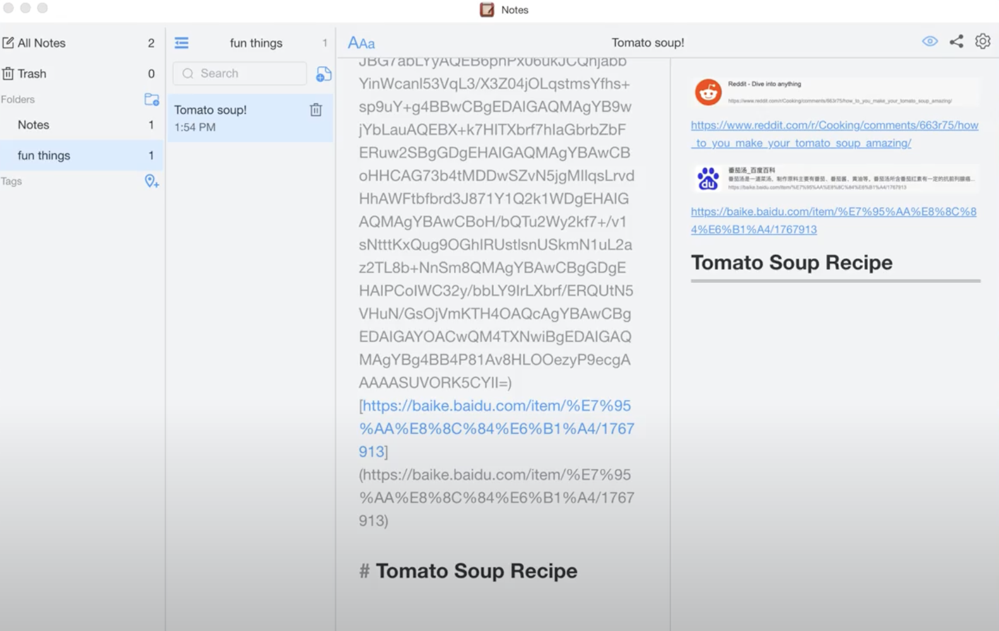

# README

# WeNotes — Desktop Note-Taking App

## Project Overview

This repository contains the code for a desktop note-taking application, designed and built for student to take study notes or jot down inspires.

## Features

Our note-taking application comes with a host of features designed for an efficient and comprehensive note-taking experience:

1. **Side-by-side Markdown Editing**: The application allows for real-time markdown editing. With this feature, you can instantly preview your markdown syntax as you type.
2. **Comprehensive Set of Formatting Tools**: Make your notes lively with our rich formatting tools. Enrich your content with headers, bold/italic text, lists, checkboxes, hyperlinks, images, code blocks, and more.
3. **Webpage snapshot**: Automatically creates snapshots for pasted webpage links.

4. **Tree-like Folder Structure with Tags**: Organize your notes effectively using our tree-like folder structure. You can also tag/pin or move your notes across folders for quick access and efficient categorization. The tags can be chosen from a spectrum of color.

.png)

.png)

5. **Document Searching**: Quickly find the notes you need with our intuitive document search feature.
6. **Export Functionality**: The application supports both HTML and PDF output options. This feature makes it easy for you to export and share your notes.
7. **Light and Dark Themes**: Choose between light and dark themes based on your preference or working environment.

.png)

## Build with

- Typescript
- JS Framework: [Vue 3](https://github.com/vuejs/vue)
- State Management: [Pinia](craftdocs://open?blockId=9A590392-0F27-4DC8-A9FE-9A9E6E7D33F4&spaceId=0e145b65-0e8c-4824-ffbd-f5419c7aad9e)
- Bundle Tooling: [Vite](https://github.com/vitejs/vite)
- UI Library & Components: [Element Plus](https://github.com/element-plus/element-plus)
- Icons: [Element Plus Icons](https://github.com/element-plus/element-plus-icons)
- Database: Sqlite3
- Query Builder: [Knex](https://github.com/knex/knex)
- Logging: [Winston](https://github.com/winstonjs/winston)
- DateTime library: [dayjs](https://github.com/iamkun/dayjs)
- Font (Google font Inter) using [vfonts](https://github.com/07akioni/vfonts)
- Application Builder: [Electron-builder](https://github.com/electron-userland/electron-builder)

## Getting Started

For mac users, double-click on the DMG file. Mac OS X will automatically mount it.

We welcome feedback and contributions from the community. Feel free to raise issues or submit pull requests.

